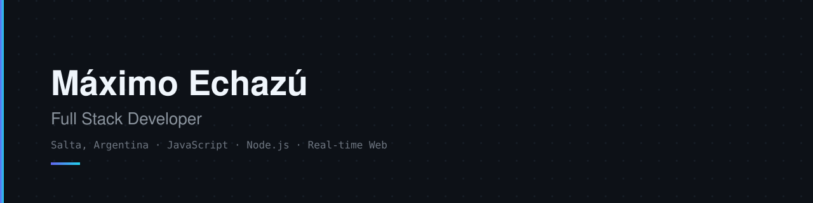
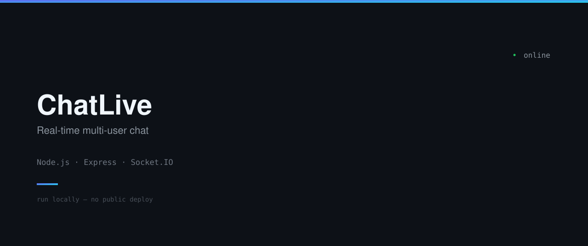
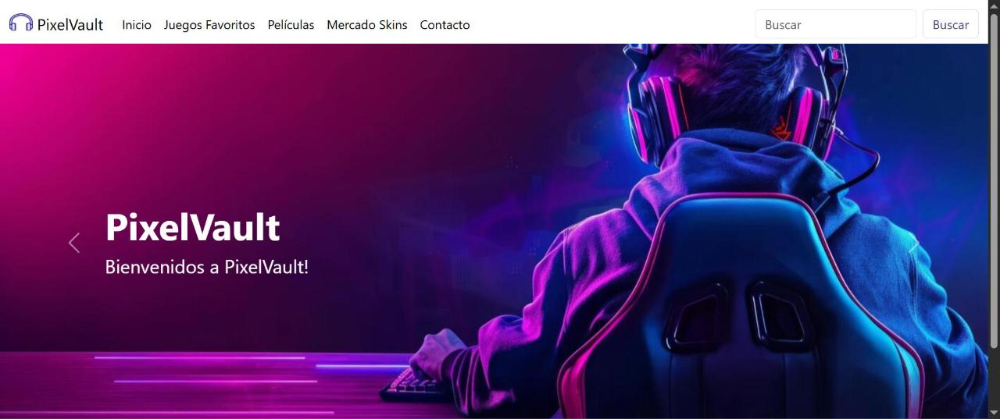
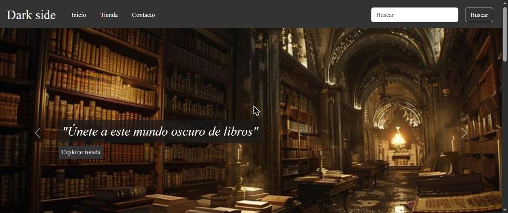

---

### About

Full stack developer focused on building interactive, real-time web applications with JavaScript, Node.js and modern CSS (Flexbox, Grid, SASS). Comfortable across the stack — from Socket.IO-powered backends to structured, responsive frontend layouts.

Based in Salta, Argentina. Currently sharpening frontend architecture and starting to explore AI-assisted and automation workflows.

---

### Stack

---

### Selected work

| Project | Description | Stack | Links |
| :--- | :--- | :--- | :--- |
| **ChatLive** | Real-time multi-user chat with a custom dark UI | Node.js · Express · Socket.IO | [repo](https://github.com/zMax98/ChatLive) |
| **PixelVault** *(coursework)* | Responsive 5-page site — Grid, Flexbox, SASS, Bootstrap | HTML · SCSS · Bootstrap | [repo](https://github.com/zMax98/PixelVault) · [demo](https://zmax98.github.io/PixelVault/) |
| **Darkside** *(coursework)* | Dark-themed landing page with semantic HTML | HTML · CSS | [repo](https://github.com/zMax98/Darkside) · [demo](https://zmax98.github.io/Darkside/) |

---

### Currently

Building small full-stack projects and picking up AI-assisted and automation workflows along the way.

---

Reach out via <a href="https://www.linkedin.com/in/maximo-echazu-453663402/">LinkedIn</a> or <a href="mailto:maxiecha98@gmail.com">email</a>.

