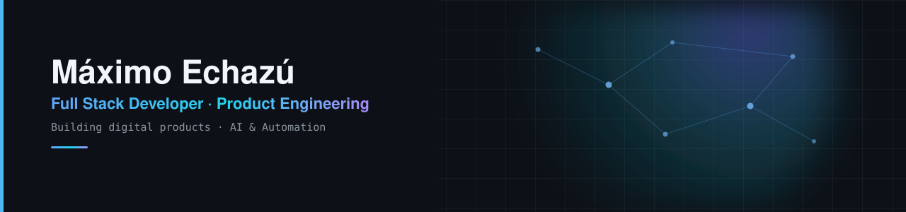

<picture>
  <source media="(prefers-color-scheme: dark)" srcset="assets/banner-dark.svg">
  <source media="(prefers-color-scheme: light)" srcset="assets/banner-light.svg">
  
</picture>

---

### About

Full stack developer focused on building and improving digital products end to end, from the interface down to the data layer.

Currently contributing to **Poncho Capital** and **Poncho Empresa**, working across frontend, QA, responsive UI/UX and product improvements, while getting deeper into backend logic and APIs.

Alongside that, I'm going further into AI, agents, automation and AI-assisted development workflows.

---

### Currently

- Working on fintech products at Poncho Capital and Poncho Empresa — frontend, QA, responsive UI/UX and product quality.
- Exploring AI-assisted development, automation and intelligent agents.

---

### Stack

**Languages**

**Frontend**

**Backend & Data**

**Tools**

AI / workflow: Claude Code · Codex · AI-assisted development · Automation workflows · AI agents

---

### Focus

AI · Machine Learning · Automation · AI Agents · Product Engineering · System Design

---

Let's connect.

